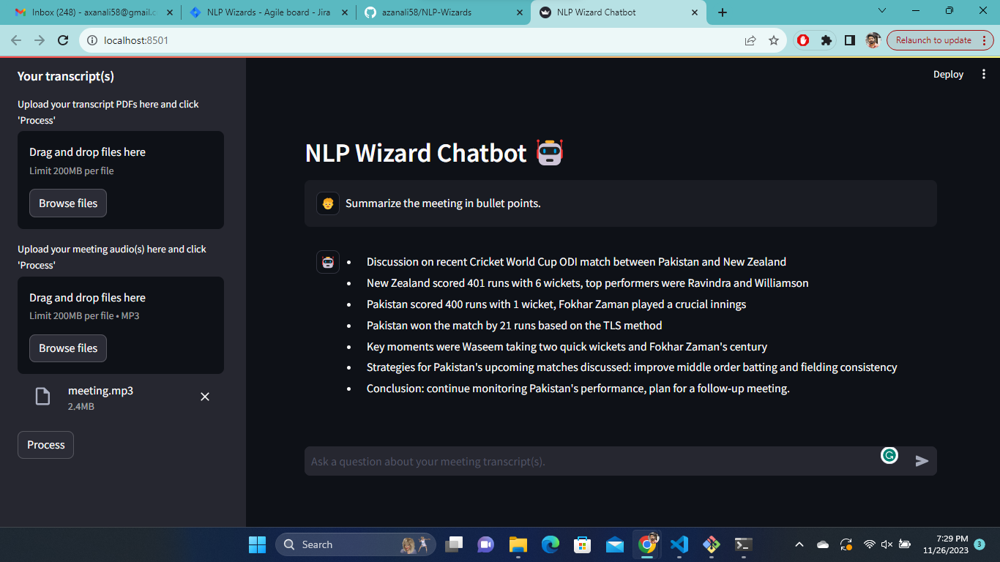

# NLP-Wizards

This repository contains a Streamlit web application that allows users to chat with multiple PDF documents. The application enables users to ask questions about their uploaded PDFs and provides answers based on the content of those documents.



## Installation

To run this application, you need to install the required dependencies. You can do this using `pip` and the provided `requirements.txt` file.
```
pip install -r requirements.txt
```
or you can simply copy the following command.
```
pip install streamlit python-dotenv pypdf2 langchain openai tiktoken faiss-cpu
```

## Usage

To launch the application, use the following command:
```
streamlit run app.py
```
This will start the Streamlit web app, which you can access in your web browser.

## Working

## PDF and Transcript Processing

The application takes one or more PDF documents or meeting transcripts as input. It extracts text from these documents using the PyPDF2 library.

## Text Chunking

The extracted text is then split into smaller chunks using the CharacterTextSplitter from the langchain library. This chunking is done to create more manageable units for analysis, defined with specific sizes and overlaps.

## Text Embeddings

The langchain library is used to obtain text embeddings. The application uses OpenAI's Chat models for text embeddings. These embeddings capture the semantic information in the text chunks.

## Vector Store

The application creates a vector store using the obtained embeddings. This vector store enables efficient similarity search and retrieval of relevant information.

## User Interaction

Users can interact with the application by asking questions about the uploaded PDFs and transcripts. The application utilizes Conversational AI models to provide responses based on the content and context of the documents.

### Configuration

The application uses environment variables to configure settings. You can set these variables in a `.env` file. You may need to customize the settings to suit your specific use case.

## Contributing

If you'd like to contribute to this project, please follow the standard open-source guidelines. You can fork the repository, make changes, and create a pull request.

## License

This project is licensed under the MIT License. You can find the full license details in the [LICENSE](LICENSE) file.

## Acknowledgments
- Streamlit: https://streamlit.io/
- PyPDF2: https://github.com/mstamy2/PyPDF2
- Hugging Face Transformers: https://huggingface.co/transformers/
- Langchain: [GitHub Repository](https://github.com/langchain-ai)

## Contact

If you have any questions or issues related to this project, please feel free to contact the author(s).

- [Azan Ali](axanali58@gmail.com)
- [Ahsan Ali](ahsan10041@gmail.com)
- [Dheeraj Kumar](dk42775252@gmail.com)
- [Khaled Elsissi](elsissikhaled@gmail.com)